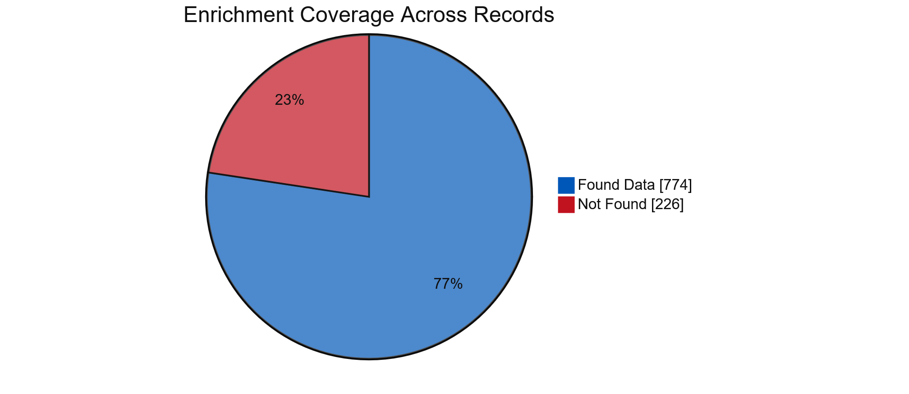
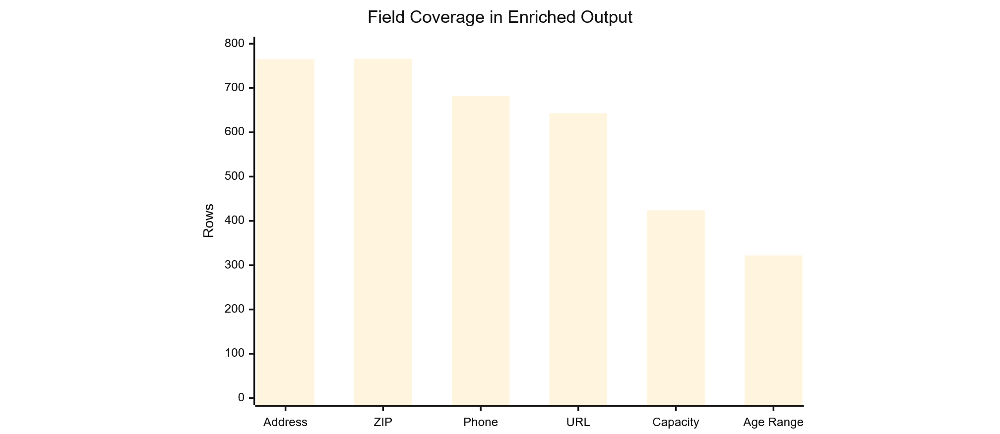
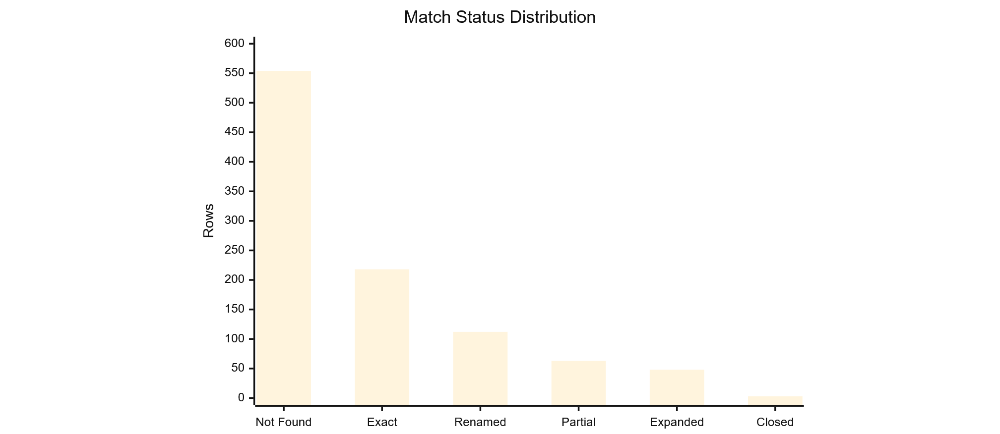

# System Flow, Architecture, and Metrics

This document summarizes how the tool works at a high level, the main technology stack and architecture, and the record-level metrics that are recoverable from the current project artifacts.

## 1. Tech Stack and Architecture
| Layer | Components | Responsibility |
|---|---|---|
| Inputs | `Input CSV`, `runtime_env.py` | Provide input data and runtime configuration |
| Core | `clean_daycare_names.py`, `enrich_daycare_data.py` | Clean names, orchestrate processing, merge results, and write outputs |
| Retrieval | State adapters, API registry, Google adapter, Winnie adapter | Fetch enrichment data from structured and fallback sources |
| Persistence | Output CSV, checkpoint JSON, Google miss file, bad proxy file, logs | Store run state, final output, and operational artifacts |
| Libraries | `requests`, `selenium`, `beautifulsoup4`, `urllib3 retry` | Networking, browser automation, parsing, and retries |

### Architectural summary
- `enrich_daycare_data.py` is the orchestration layer.
- `clean_daycare_names.py` prepares and expands provider-name variants.
- `adapters/` and `apis/` hold source-specific logic.
- Google and Winnie act as fallback sources when structured sources do not produce enough data.
- Persistence is local and file-based: output CSV, checkpoint JSON, Google miss registry, bad proxy registry, and logs.

## 2. End-to-End Working Flow

## 3. Record Metrics

### 3.1 Exact metrics recoverable from the current enriched output
***Rows with any enriched datapoint:***

***Field coverage:***

| Metric | Count |
|---|---:|
| Rows with at least one of Address / ZIP / Phone / URL / Capacity / Age Range | 774 |
| Rows with none of those datapoints | 226 |
| Mailing_Address populated | 765 |
| Mailing_Zip populated | 766 |
| Telephone populated | 682 |
| URL populated | 643 |
| Capacity (optional) populated | 424 |
| Age Range (optional) populated | 322 |

### 3.2 Match-status distribution in current output

### Conflict Handling and Resolution Logic
| Scenario | How the tool resolves it |
|---|---|
| Structured state source returns enough data | Prefer structured or official source first |
| Structured source is weak or empty | Try Google fallback |
| Google is weak or empty | Try Winnie fallback |
| Candidate name is close to input name | `exact_match` |
| Candidate is same city but renamed | `renamed_likely` |
| Candidate overlaps partially with supporting evidence | `partial_match` |
| Candidate only matches via expanded name variants | `expanded_match` |
| Official or source indicates inactive or closed | `closed_likely` |
| No acceptable evidence found | `not_found` |

| Match Status | Count |
|---|---:|
| `exact_match` | 218 |
| `renamed_likely` | 112 |
| `partial_match` | 63 |
| `expanded_match` | 48 |
| `closed_likely` | 3 |
| `not_found` | 554 |
| blank | 2 |

